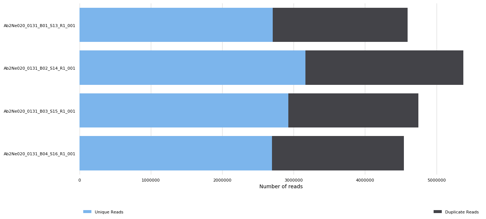
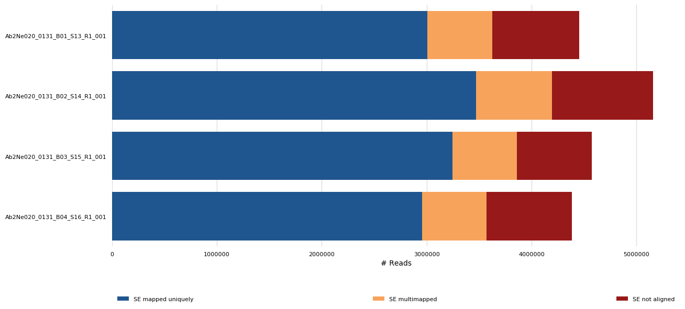
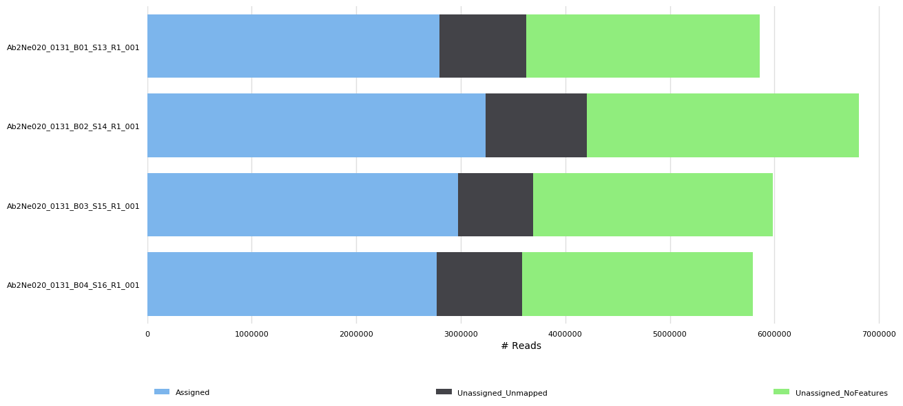
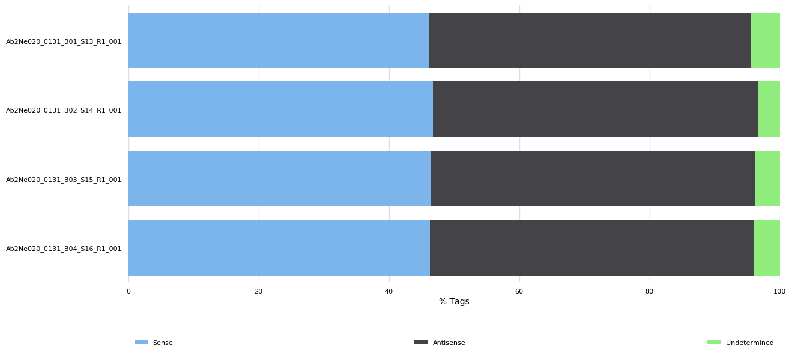
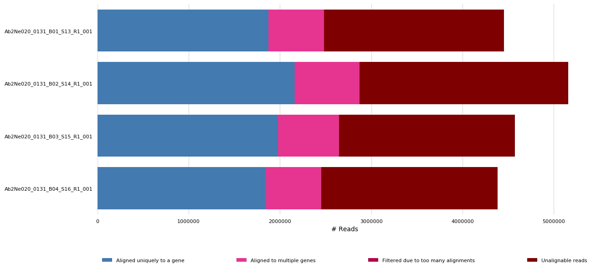

# ramdaq: Output

This document describes the output produced by the pipeline. Most of the plots are taken from the MultiQC report, which summarises results at the end of the pipeline.

<!-- TODO : Write this documentation describing your workflow's output -->

## Pipeline overview

The pipeline is built using [Nextflow](https://www.nextflow.io/)
and processes data using the following steps:

* [FastQC](#fastqc) - read quality control
* [fastq-mcf](#fastq-mcf) - fastq trimming
* [HISAT2](#hisat2) - memory efficient splice aware alignment to a reference
* [SAMtools](#samtools) - Sort and index alignments
* [featureCounts](#featurecounts) - Read counting relative to gene and biotype
* [RSeQC](#rseqc) - Various RNA-seq QC metrics
* [ReadCoverage.jl](#readcoverage.jl)
* [RSEM via Bowtie2](#rsem-via-bowtie2) - Alignment and quantification of expression levels
* [MultiQC](#multiqc) - aggregate report, describing results of the whole pipeline
* [Pipeline information](#pipeline-information) - Report metrics generated during the workflow execution

All output files are saved at `results` directory. If you want to name it arbitrarily, you can change the directory name with the `--outdir [dirname]` option.

## FastQC

[FastQC](http://www.bioinformatics.babraham.ac.uk/projects/fastqc/) gives general quality metrics about your reads. It provides information about the quality score distribution across your reads, the per base sequence content (%T/A/G/C). You get information about adapter contamination and other overrepresented sequences.

For further reading and documentation see the [FastQC help](http://www.bioinformatics.babraham.ac.uk/projects/fastqc/Help/).

> **NB:** FastQC outputs two types of plots: before trimming (raw) and after trimming (trimmed). Trimming removes adapter sequences and potentially poor quality regions (use Fastqmcf, described below).

**Output directory: `results/fastqc (raw) and results/fastqc.trim (trimmed)`**

* `*.raw_fastqc.html`(raw),  `*.trim_fastqc.html`(trimmed)
  * FastQC report, containing quality metrics for your untrimmed raw fastq files
* `zips/*.raw_fastqc.zip`(raw),  `*.trim_fastqc.zip`(trimmed)
  * zip file containing the FastQC report, tab-delimited data file and plot images

## fastq-mcf

[fastq-mcf](https://expressionanalysis.github.io/ea-utils/) scans a sequence file for adapters, and, based on a log-scaled threshold, determines a set of clipping parameters and performs clipping. Also does skewing detection and quality filtering.

See [usage](usage.md) for the options available in this pipeline. For further reading and documentation see the [description](https://github.com/ExpressionAnalysis/ea-utils/blob/wiki/FastqMcf.md).

**Output directory: `results/fastqmcf`**

* `*.trim.fastq.gz`
  * Trimmed fastq files (compressed)

## HISAT2

[HISAT2](http://daehwankimlab.github.io/hisat2/) is a fast and sensitive alignment program for mapping next-generation sequencing reads (both DNA and RNA) to a population of human genomes as well as to a single reference genome. It introduced a new indexing scheme called a Hierarchical Graph FM index (HGFM) which when combined with several alignment strategies, enable rapid and accurate alignment of sequencing reads. The HISAT2 route through the pipeline is a good option if you have memory limitations on your compute.

See [usage](usage.md) for the options available in this pipeline.

## SAMtools

The original BAM files generated by the selected alignment algorithm are further processed with [SAMtools](http://samtools.sourceforge.net/) to sort them by coordinate, for indexing, as well as to generate read mapping statistics.

**Output directory: `results/hisat2`**

* `*.bam`
  * binary files that contains sequence alignment data
* `*.bam.bai`
  * bam index files provide an index of the corresponding bam file
* `*.bam.flagstat`
  * counts of the number of alignments for each FLAG type from each bam files
* `logs/*_summary.txt`
  * HISAT2 alignment report containing the mapping results summary.

**Output directory: `results/merged_output_files`**

* `merged_hisat2_totalseq.txt`
  * merged file with flagstat results

## featureCounts

[featureCounts](http://bioinf.wehi.edu.au/featureCounts/) from the [Subread](http://subread.sourceforge.net/) package is a quantification tool used to summarise the mapped read distribution over genomic features such as genes, exons, promotors, gene bodies, genomic bins and chromosomal locations. We can also use featureCounts to count overlaps with different classes of genomic features. This provides an additional QC to check which features are most abundant in the sample, and to highlight potential problems such as rRNA contamination.

We output more detailed QC plots using our own custom rRNA, mitochondrial, and histone annotations, in addition to the usual transcript counts. Check out the details on [local_annotation](local_annotation.md) and see [usage](usage.md) for the options available in this pipeline.

**Output directory: `results/featureCounts`**

* `gene_counts/*_gene.featureCounts.txt`
  * gene-level quantification results for each sample
* `biotype_counts/*_mqc.tsv, biotype_counts/*_mqc.txt`
  * MultiQC custom content files used to plot biotypes in report
* `gene_count_summaries/*_gene.featureCounts.txt.summary`
  * overall statistics about the counts

**Output directory: `results/featureCounts_Histone, results/featureCounts_Mitocondria, results/featureCounts_rRNA`**

* `*.featureCounts.txt`
  * quantification results for each annotation
* `*.featureCounts.txt.summary`
  * overall statistics about the counts for each annotation

**Output directory: `results/merged_output_files`**

* `merged_featureCounts_gene.txt`
  * Matrix of gene-level raw counts across all samples.
* `merged_featureCounts_gene_TPM.txt`
  * Matrix of gene-level TPM (Transcripts Per Kilobase Million) counts across all samples
* `merged_featureCounts_gene_ERCC.txt`
  * Matrix of ERCC (RNA Spike-in Controls for Gene Expression) count. Output only if the sample contains ERCC.

## RSeQC

[RSeQC]((http://rseqc.sourceforge.net/)) is a package of scripts designed to evaluate the quality of RNA-seq data. This pipeline runs several, but not all RSeQC scripts. Default will run : `bam2wig.py`, `infer_experiment.py`, `read_distribution.py` and `inner_distance.py` (on pair-end).

### Infer experiment

This script predicts the "strandedness" of the protocol (i.e. unstranded, sense or antisense) that was used to prepare the sample for sequencing by assessing the orientation in which aligned reads overlay gene features in the reference genome.

RSeQC documentation: [infer_experiment.py](http://rseqc.sourceforge.net/#infer-experiment-py)

**Output directory: `results/rseqc/infer_experiment/`**

* `*.inferexp.txt`
  * File containing fraction of reads mapping to given strandedness configurations.

### Read distribution

This tool calculates how mapped reads are distributed over genomic features.

RSeQC documentation: [read_distribution.py](http://rseqc.sourceforge.net/#read-distribution-py)

**Output directory: `results/rseqc/read_distribution/`**

* `*.readdist.txt`
  * File containing fraction of reads mapping to genome feature e.g. CDS exon, 5’UTR exon, 3’ UTR exon, Intron, Intergenic regions etc.

**Output directory: `results/merged_output_files`**

* `merged_readdist_totalread.txt`
  * The output of read distribution for aggregation of reads assigned to genomes.

### Inner distance

The inner distance script tries to calculate the inner distance between two paired-end reads.

RSeQC documentation: [inner_distance.py](http://rseqc.sourceforge.net/#inner-distance-py)

**Output directory: `results/rseqc/inner_distance/`**

* `*.inner_distance_plot.pdf`
  * PDF file containing inner distance plot.
* `*.inner_distance_plot.r`
  * R script used to generate pdf plot above.
* `*.inner_distance_freq.txt`
  * File containing frequency of insert sizes.
* `*.inner_distance.txt`
  * File containing mean, median and standard deviation of insert sizes.

## ReadCoverage.jl

Instead of `RSeQC::geneBody_coverage.py` we use [ReadCoverage.jl](https://github.com/bioinfo-tsukuba/ReadCoverage.jl), which can calculate absolute and relative gene body coverage of bulk/single-cell RNA-seq data very fast.

**Output directory: `results/rseqc/genebody_coverage/`**

* `*.geneBodyCoverage.txt`
  * File containing results of calculating the RNA-seq reads coverage over gene body

## RSEM via Bowtie2

[Bowtie2](http://bowtie-bio.sourceforge.net/bowtie2/index.shtml) is an ultrafast and memory-efficient tool for aligning sequencing reads to long reference sequences. It is particularly good at aligning reads of about 50 up to 100s of characters to relatively long (e.g. mammalian) genomes. Bowtie2 is often the first step in pipelines for comparative genomics, including for variation calling, ChIP-seq, RNA-seq, BS-seq, but here we use it for transcripts mapping for isoform-level expression quantification by RSEM.

[RSEM](https://github.com/deweylab/RSEM) is a software package for estimating gene and isoform expression levels from RNA-seq data. It has been widely looked as one of the most accurate quantification tools for RNA-seq analysis. RSEM wraps other popular tools (i.e. STAR, Bowtie2, HISAT2; Bowtie2 is used in this pipeline) to map reads to the transcriptome before quantifying the gene- and isoform-level expression.

**Output directory: `results/rseqc/rsem_bowtie2_allgenes/`**

* `*.genes.results`
  * gene-level quantification results for each sample.
* `*.isoforms.results`
  * transcript-level quantification results for each sample.
* `*.stat`
  * A folder that contains model parameters learned. All model related statistics are stored in this folder.

**Output directory: `results/merged_output_files/`**

* `merged_rsemResults_genes_TPM.txt`
  * Matrix of gene-level expression quantification results in TPM for all samples.
* `merged_rsemResults_isoforms_TPM.txt`
  * Matrix of transcript-level expression quantification results in TPM for all samples.

## MultiQC

[MultiQC](http://multiqc.info) is a visualisation tool that generates a single HTML report summarising all samples in your project. Most of the pipeline QC results are visualised in the report and further statistics are available in within the report data directory.

The pipeline has special steps which allow the software versions used to be reported in the MultiQC output for future traceability.

**Output directory: `results/multiqc`**

* `Project_multiqc_report.html`
  * MultiQC report - a standalone HTML file that can be viewed in your web browser
* `Project_multiqc_data/`
  * Directory containing parsed statistics from the different tools used in the pipeline

For more information about how to use MultiQC reports, see [http://multiqc.info](http://multiqc.info)

## Pipeline information

**Output directory: `results/pipeline_info`**

* Reports generated by Nextflow: `execution_report.html`, `execution_timeline.html`, `execution_trace.txt` and `pipeline_dag.dot`/`pipeline_dag.svg`.
* Reports generated by the pipeline: `pipeline_report.html`, `pipeline_report.txt` and `software_versions.csv`.
